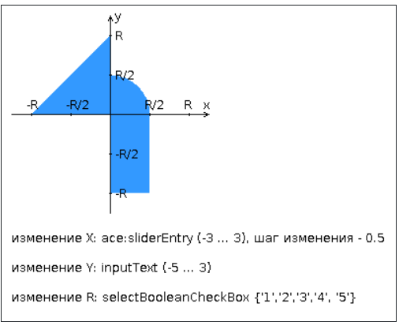

# Web-MVC-App
JSF, Hibernate, PostgreSQL

## Требования
* [Java 8 и выше](https://www.oracle.com/java/technologies/downloads/)
* [Maven](https://maven.apache.org/)
* [PostgreSQL](https://www.postgresql.org/)
* Нужен сервер приложений (например [Tomcat](https://tomcat.apache.org/), [Wildlfy](https://www.wildfly.org/))

## Использование
&emsp; _Для того, чтобы собрать war введите команду_
```bash
    mvn package
```
&emsp; _Внутри конфигурационного файла hibernate.cfg.xml задать параметры для подключения в бд_
```xml
<property name="connection.url">url</property>
<property name="connection.username">username</property>
<property name="connection.password">password</property>
```

## Особености
* Реализован паттерн __IoC__.   
* Аннотация ___@Application___ говорит о том, что происходит сканирование пакета, в котором находится этот класс  
* Создаются бины по фильтру(Если класс помечен ___@Component___, ___@Service___, ___@Repository___)
* Можно помечать поле аннотацией ___@Autowired___, как автоматически подключаемые средствами внедрения зависимостей.
* ___@Qualifier___ эту аннотацию можно использовать в поле или параметре в качестве квалификатора для компонентов-кандидатов при автоподключении.
```java
import custom.annotations.*;

@Application
@Component
@Autowired
@Service
@Repository
@Qualifier
```


## Описания задания
Разработать приложение на базе JavaServer Faces Framework, которое осуществляет проверку попадания точки в заданную область на координатной плоскости.

Приложение должно включать в себя 2 facelets-шаблона - стартовую страницу и основную страницу приложения, а также набор управляемых бинов (managed beans), реализующих логику на стороне сервера.

* __Стартовая страница должна содержать следующие элементы:__
  * "Шапку", содержащую ФИО студента, номер группы и номер варианта.
  * Интерактивные часы, показывающие текущие дату и время, обновляющиеся раз в 10 секунд.
  * Ссылку, позволяющую перейти на основную страницу приложения.

* __Основная страница приложения должна содержать следующие элементы:__
  * Набор компонентов для задания координат точки и радиуса области в соответствии с вариантом задания. Может потребоваться использование дополнительных библиотек компонентов - ICEfaces (префикс "ace") и PrimeFaces (префикс "p"). Если компонент допускает ввод заведомо некорректных данных (таких, например, как буквы в координатах точки или отрицательный радиус), то приложение должно осуществлять их валидацию.
  * Динамически обновляемую картинку, изображающую область на координатной плоскости в соответствии с номером варианта и точки, координаты которых были заданы пользователем. Клик по картинке должен инициировать сценарий, осуществляющий определение координат новой точки и отправку их на сервер для проверки её попадания в область. Цвет точек должен зависить от факта попадания / непопадания в область. Смена радиуса также должна инициировать перерисовку картинки.
  * Таблицу со списком результатов предыдущих проверок.
  * Ссылку, позволяющую вернуться на стартовую страницу

<br/>

* __Дополнительные требования к приложению:__
  * Все результаты проверки должны сохраняться в базе данных под управлением СУБД Oracle.
  * Для доступа к БД необходимо использовать ORM Hibernate.
  * Для управления списком результатов должен использоваться Application-scoped Managed Bean.
  * Конфигурация управляемых бинов должна быть задана с помощью параметров в конфигурационном файле.
  * Правила навигации между страницами приложения должны быть заданы в отдельном конфигурационном файле.

  